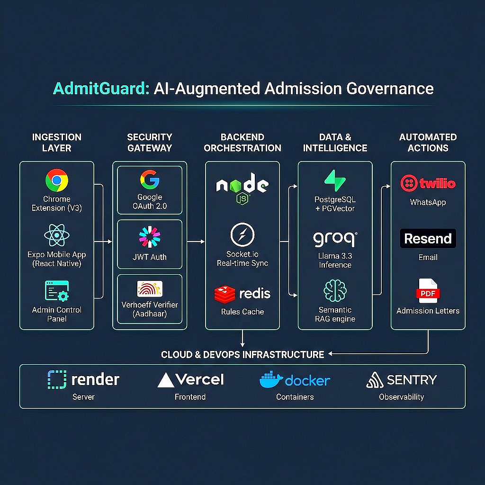
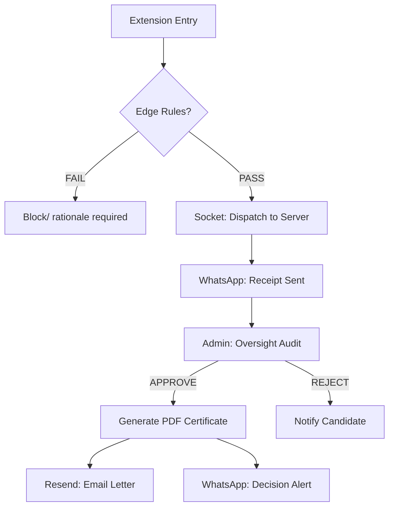
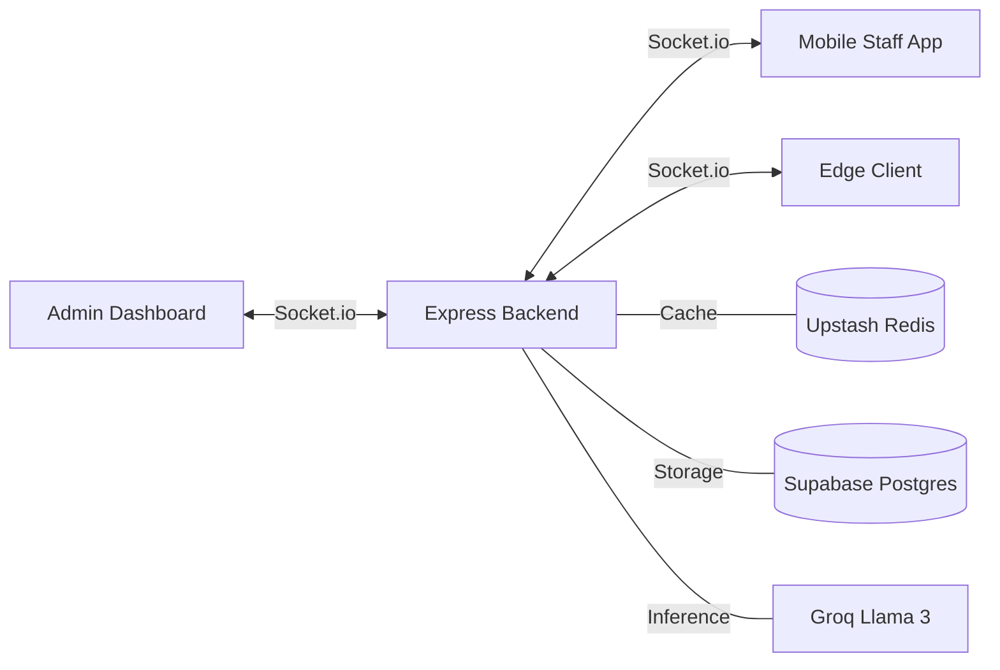

# AdmitGuard: An AI-Powered Distributed Governance Framework for High-Integrity Admissions

## 📄 Abstract
AdmitGuard introduces a novel, distributed approach to admissions governance, leveraging a combination of **edge-validation algorithms**, **multi-stage AI reasoning**, and **latent semantic search**. By distributing rule enforcement to the point of data entry (Chrome Extension) and centralizing decision-making through an AI-augmented dashboard and mobile counselor suite, the framework mitigates data entry errors, prevents identity spoofing, and provides management with deep, context-aware insights into admissions trends.

---

## 1. Technical Infrastructure & Component Matrix

### 🚀 Core Technologies Leveraged
 
 
 

 
 

 

### 🗺️ System Architecture

| Module | Technology | Functional Role |
| :--- | :--- | :--- |
| **Edge Client** |   | Browser extension for real-time governance & local draft persistence |
| **Counselor App** |   | Mobile suite for on-the-go submission audit & staff tracking |
| **Command Center** |   | Secured Admin dashboard with PII masking & Pipeline management |
| **Backend Core** |   | API Orchestration, JWT Auth, and System Coordination |
| **Persistence** |   | Relational storage & high-dimensional vector similarity |
| **Automation** |   | Real-time notifications & Automated Admission Letters (PDF) |
| **Sync & Cache** |   | Bi-directional real-time sync & low-latency rule delivery |
| **Observability** |   | Enterprise error tracking & containerized deployment |
| **Inference Layer** |   | RAG Pipeline, SQL Generation, and Semantic Trend Analysis |

---

## 2. Introduction
The student admissions process in modern institutions is fraught with two primary challenges: **Data Entry Integrity** and **Auditability**. Conventional systems rely on post-facto verification, which is both slow and prone to oversight. AdmitGuard addresses these by implementing a **"Governance-at-the-Source"** model. This framework ensures that any deviation from predetermined academic or institutional criteria is flagged instantly and requires a human-provided, AI-audited rationale for submission.

---

## 3. System Architecture & Methodology
AdmitGuard is architected as a four-tier distributed system ensuring zero-latency validation and high-resolution oversight.

### 3.1 Tier 1: The Edge Client (Chrome Extension)
Operating directly at the point of data entry, the extension uses a dual-plane logic:
*   **Hard-Rule Plane**: Deterministic algorithms (including Verhoeff checksums for IDs) to block invalid data.
*   **Soft-Rule Plane**: Evaluates candidate profiles against cloud-synced rules. If a violation is detected (e.g., age or GPA), it mandates a **Rationale Keyword Match** before allowing submission.

### 3.2 Tier 2: Counselor Suite (Mobile App)
A dedicated **React Native/Expo** application for field officers:
*   **Personal Submission Stream**: Counselors view their own filtered audit logs via secure JWT-authenticated sessions.
*   **Real-time Decision Sync**: Leveraging **Socket.io**, counselors receive instant push-like updates when a manager approves or rejects their submitted candidates.
*   **Biometric-ready Security**: Built with `expo-secure-store` to maintain high-integrity credential management.

### 3.3 Tier 3: Command Center (Admin Dashboard)
A centralized web interface for institutional managers:
*   **PII Masking Canvas**: Dynamically hides sensitive fields (email, phone, Aadhaar) to ensure GDPR/FERPA compliance during initial auditing.
*   **Kanban Pipeline**: Drag-and-drop state management for candidates moving from `Pending` to `Approved`.
*   **Rule Sculpting**: Managers can modify eligibility thresholds (GPA, Age, keywords) which are propagated to all clients in real-time via Redis and WebSockets.

### 3.4 Tier 4: Autonomous Backend & Automation
The Node.js core acts as the "Central Intelligence Agency":
*   **Vectorized Rationale Store**: Converts rationale strings into 384-dimensional vectors using **Xenova/all-MiniLM-L6-v2**.
*   **Admission Letter Engine**: Uses **PDFKit** to generate professionally branded, internally signed admission certificates upon approval.
*   **Multi-Channel Outreach**: Integrates **Resend (Email)** and **Twilio (WhatsApp)** to keep candidates informed at every pipeline stage.

---

## 4. Advanced Algorithms & Security

### 4.1 Verhoeff Checksum Integration
To prevent transcription errors in identity documents (e.g., Aadhaar), AdmitGuard implements the **Verhoeff Algorithm**. It utilizes the Dihedral group $D_5$ to catch 100% of single-digit errors and 95.5% of adjacent transposition errors, ensuring "Identity Integrity" at the edge.

### 4.2 Real-time State Synchronization (WebSockets)
Unlike traditional polling, AdmitGuard maintains a persistent **Socket.io** connection across all components.
*   **Staff Registry**: Real-time tracking of counselor activity.
*   **Live Audit Feed**: Submissions appear on the Manager's dashboard instantly the moment they are entered in the browser extension.

### 4.3 Semantic Reasoning & RAG
The "AI Insights" panel uses a **Retrieval-Augmented Generation (RAG)** workflow:
1.  **Intent Decoder**: Analyzes manager queries to decide between SQL execution (Quant) or Semantic Search (Qual).
2.  **pgvector Search**: Performs cosine similarity search across candidate rationales to identify hidden patterns (e.g., *"Why are so many 2024 graduates failing the GPA rule?"*).
3.  **Synthesis**: Combines raw database counts with AI-detected trends to suggest rule optimizations.

---

## 5. Logic Flow & Infrastructure

### 5.1 Admission-to-Letter Pipeline

### 5.2 Real-time Sync Architecture

---

## 6. Deployment & Scalability

AdmitGuard is architected for institutional scale with a multi-cloud topology:
*   **Frontend (Vercel)**: Global CDN for the Command Center.
*   **Compute (Render)**: Auto-scaling Node.js backend.
*   **Database (Supabase)**: Multi-region Postgres with pgvector support.
*   **Caching (Upstash)**: Global Redis for rule-syncing (<10ms latency).
*   **Observability (Sentry)**: Full-stack error monitoring and performance profiling.
*   **Containerization (Docker)**: Standardized environment for the backend core.

---

## 7. Conclusions
AdmitGuard represents a shift in admissions technology from passive record-keeping to **active, automated governance**. By combining deterministic algorithms like Verhoeff with stochastic AI models like Llama 3 and real-time triggers via Twilio/Redis, the framework provides a "Human-in-the-Loop" system that is both rigid in its compliance and frictionless in its communication.

---
*Technical Documentation for the AdmitGuard Project — High-Integrity Admissions Distributed Framework.*
