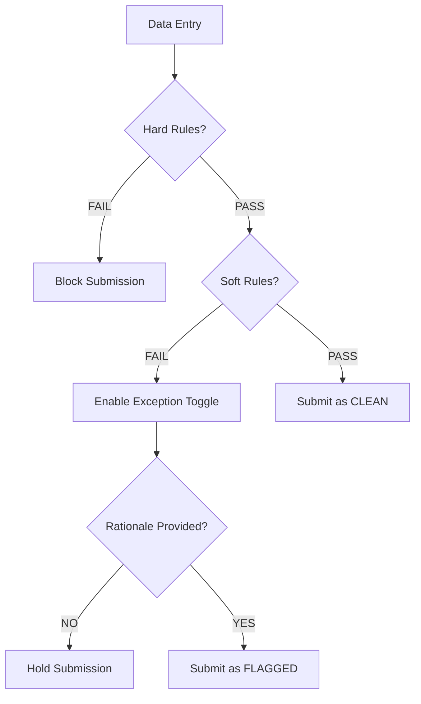
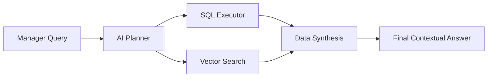

# AdmitGuard: An AI-Powered Distributed Governance Framework for High-Integrity Admissions

## 📄 Abstract
AdmitGuard introduces a novel, distributed approach to admissions governance, leveraging a combination of **edge-validation algorithms**, **multi-stage AI reasoning**, and **latent semantic search**. By distributing rule enforcement to the point of data entry (Chrome Extension) and centralizing decision-making through an AI-augmented dashboard, the framework mitigates data entry errors, prevents identity spoofing, and provides management with deep, context-aware insights into admissions trends.

---

## 1. Technical Infrastructure & Component Matrix

### 🚀 Core Technologies Leveraged
 
 
 
 
 

 

 

| Module | Technology | Functional Role |
| :--- | :--- | :--- |
| **Edge Engine** |   | Real-time governance & local draft persistence |
| **Command Center** |   | Secured Admin dashboard with JWT session state |
| **Backend Core** |   | Identity Verification (OIDC) & API Orchestration |
| **Persistence** |   | Transactional storage & high-dim vector similarity |
| **Automation** |   | Real-time notifications & low-latency rule caching |
| **Observability** |  | Enterprise-grade error tracking & performance metrics |
| **Inference Layer** |   | Natural Language Reasoning & SQL Planning |

---

## 2. Introduction
The student admissions process in modern institutions is fraught with two primary challenges: **Data Entry Integrity** and **Auditability**. Conventional systems rely on post-facto verification, which is both slow and prone to oversight. AdmitGuard addresses these by implementing a **"Governance-at-the-Source"** model. This framework ensures that any deviation from predetermined academic or institutional criteria is flagged instantly and requires a human-provided, AI-audited rationale for submission.

---

## 3. System Architecture & Methodology
AdmitGuard is architected as a three-tier distributed system comprising an Edge Client, a Vectorized Backend, and an Oversight Dashboard.

### 3.1 The Edge Client (Chrome Extension)
The client-side engine is responsible for real-time validation. It operates on two distinct logical planes:
*   **Hard-Rule Plane (Strict Validation)**: Uses deterministic algorithms to prevent non-compliant data from being submitted.
*   **Soft-Rule Plane (Conditional Exception)**: Dynamically evaluates candidate profiles against cloud-synchronized rules (Age, GPA, Graduation Year). If a "soft violation" occurs, a state-machine prevents submission until a valid **Exception Rationale** is provided.

### 3.2 Managerial Oversight & Advanced Analytics Interface (Admin Dashboard)
A centralized command-and-control dashboard structured to facilitate high-resolution auditing and decision-making. 
*   **Granular PII Masking Architecture**: To maintain GDPR and institutional data privacy compliance, the interface implements a one-click **PII Layer** that dynamically masks sensitive identifying fields (Email, Aadhaar, Phone) during the initial audit phase.
*   **Operational Pipeline Management**: Implements a state-machine driven **Pipeline View** (Kanban style). It allows managers to visually transition candidates between `Pending`, `Flagged`, `Approved`, and `Rejected` statuses, ensuring zero-loss pipeline visibility.
*   **Real-time Intelligence Integration**: Directly interfaces with the **Groq-powered RAG engine**, providing an interactive sidebar where managers can ask complex structural questions like *"Identify all 2024 graduates with inconsistent screening scores"* and receive immediate, linked profile recommendations.
*   **Adaptive Rule Sculpting**: Enables managers to modify institutional criteria (thresholds, keyword requirements, checksum toggles) instantly. These changes are versioned and propagated to all Edge Clients upon their next polling cycle.

---

## 4. Data Integrity & Algorithms
AdmitGuard employs sophisticated mathematical models to ensure data validity.

### 4.1 Verhoeff Error Detection
To combat identity document fraud (e.g., Aadhaar entry), the framework implements the **Verhoeff Algorithm**. Unlike simple modulo-based checks, Verhoeff uses a non-commutative group $D_5$ (Dihedral group of order 10).
*   **Permutation Table**: Rotates digits to catch transcription errors.
*   **D5 Multiplication**: Ensures that single-digit errors and most adjacent transposition errors are detected.

### 4.2 Dynamic Rule Synchronization
The system uses a polling-and-cache mechanism to ensure that the Edge Client always has the latest institutional criteria. Rules are stored in the backend as `JSONB` structures, allowing for field-level flexibility without schema migrations.

---

## 5. AI & Semantic Reasoning Engine
The core intelligence of AdmitGuard is built upon a **Retrieval-Augmented Generation (RAG)** pipeline.

### 5.1 Rationale Vectorization
When an officer provides a justification for a rule exception, the string is processed through the **Xenova `all-MiniLM-L6-v2`** model. This generates a 384-dimensional dense vector representing the "semantic weight" of the justification.
$$v = \text{Embed}(\text{Rationale})$$
These vectors are stored in a **PostgreSQL `vector`** column, allowing for cosine similarity queries.

### 5.2 Multi-Stage AI Reasoning (Groq Llama 3)
The AI Assistant (`/api/analyze`) uses a specialized agentic workflow to answer manager queries:
1.  **Intent Classification**: The agent analyzes if the user is asking for **Quantitative** (e.g., "Top 5 scores") or **Qualitative** (e.g., "Trends in grad year waivers") data.
2.  **Query Generation**:
    *   **SQL Generation**: For quantitative queries, the AI writes and executes PostgreSQL queries against the JSONB fields.
    *   **Vector Search**: For qualitative queries, it performs a similarity search ($1 - \text{cosine\_distance}$) to retrieve the most semantically relevant candidate files.
3.  **Synthesis**: The final response combines raw numerical data with latent pattern recognition (e.g., *"There is a 30% increase in GPA waivers for 2024 graduates, suggesting the current threshold may be statistically too high"*).

---

## 6. Authentication & Identity Governance
To ensure institutional record-keeping is protected from unauthorized access, AdmitGuard implements a **Public Intake, Private Audit** security model:

*   **Google OAuth 2.0 Integration**: The Admin Dashboard requires a valid Google Identity token to initialize. Sessions are cryptographically verified using Google's OpenID Connect (OIDC) protocol.
*   **Zero-Trust Whitelisting**: Access to the core data APIs (Rules, Analysis, Pipeline) is restricted to pre-authorized administrator emails managed via secure environment variables (`ADMIN_EMAILS`).
*   **Hybrid Endpoint Access**: 
    *   **Ingress (Public)**: The `POST /api/submissions` endpoint is open to allow seamless data intake from the distributed browser extensions.
    *   **Egress (Secured)**: All diagnostic, analytics, and decision-making endpoints require a valid Bearer token, preventing data exfiltration even if the API endpoint is publicly discovered.

---

## 7. Deployment & Distributed Cloud Topology

To ensure institutional-grade availability and low-latency inference, AdmitGuard implements a multi-cloud distribution strategy:

### 🗺️ Infrastructure Stack

 

*   **Persistence Layer (Supabase)**: The PostgreSQL instance, along with the `pgvector` semantic store, is hosted on **Supabase**. This provides high-performance vectorized operations with integrated connection pooling and real-time data synchronization.
*   **Application Compute (Render)**: The Node.js/Express.js backend resides on **Render**, serving as the secure orchestrator between client requests, database transactions, and high-speed external APIs.
*   **Global Caching (Upstash Redis)**: Low-latency rule delivery and rate-limiting are handled by **Upstash Redis**, ensuring the Edge Client receives governance updates in <10ms.
*   **Managerial Portal (Vercel)**: The Administrative Dashboard (Frontend) is distributed via **Vercel's global CDN**, ensuring instantaneous loading of candidate pipelines and analytics.
*   **Governance Edge (Chrome Web Store)**: The browser extension is distributed as a hardened package, enabling localized rule enforcement directly within the officer's browser environment.

---

## 8. Logic Flow & State Diagrams

### 8.1 Submission Validation Flow

### 8.2 AI RAG Pipeline

---

## 10. Automated Communication & Notification Pipeline

AdmitGuard bridges the gap between institutional decisions and student awareness through an automated **Twilio WhatsApp Pipeline**.

*   **Submission Receipts**: Instant confirmation messages are dispatched the moment a candidate triggers the Edge Engine, reducing candidate anxiety and support volume.
*   **Decision Triggers**: When a manager clicks "Approve" or "Reject" on the Command Center, a background task generates a personalized WhatsApp notification reflecting the specific outcome.
*   **Async Processing**: All notifications are processed asynchronously to ensure that the Managerial Dashboard remains highly responsive even during high-volume notification bursts.

---

## 11. Monitoring & Enterprise Observability

To ensure institutional-grade uptime, AdmitGuard implements a two-tier observability stack:

*   **Real-time Error Tracking (Sentry)**: Every backend exception, AI reasoning failure, or database timeout is captured by **Sentry**. This provides developers with deep stack-traces and candidate context to resolve production issues before they affect the intake pipeline.
*   **Low-Latency Caching (Redis)**: Utilizing the **Least Recently Used (LRU)** eviction policy, Upstash Redis caches institutional rules and AI insights. This prevents "Database Bottlenecks" during peak admission cycles and ensures the system remains "snappy" even under heavy load.

---

## 12. Conclusions
AdmitGuard represents a shift in admissions technology from passive record-keeping to **active, automated governance**. By combining deterministic algorithms like Verhoeff with stochastic AI models like Llama 3 and real-time triggers via Twilio/Redis, the framework provides a "Human-in-the-Loop" system that is both rigid in its compliance and frictionless in its communication.

---
*Technical Documentation & Research Report for the AdmitGuard Project.*
