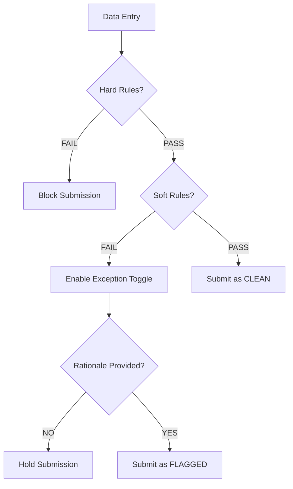
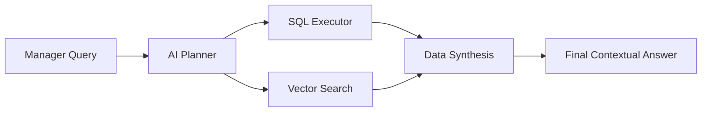

# AdmitGuard: An AI-Powered Distributed Governance Framework for High-Integrity Admissions

## 📄 Abstract
AdmitGuard introduces a novel, distributed approach to admissions governance, leveraging a combination of **edge-validation algorithms**, **multi-stage AI reasoning**, and **latent semantic search**. By distributing rule enforcement to the point of data entry (Chrome Extension) and centralizing decision-making through an AI-augmented dashboard, the framework mitigates data entry errors, prevents identity spoofing, and provides management with deep, context-aware insights into admissions trends.

---

## 1. Introduction
The student admissions process in modern institutions is fraught with two primary challenges: **Data Entry Integrity** and **Auditability**. Conventional systems rely on post-facto verification, which is both slow and prone to oversight. AdmitGuard addresses these by implementing a **"Governance-at-the-Source"** model. This framework ensures that any deviation from predetermined academic or institutional criteria is flagged instantly and requires a human-provided, AI-audited rationale for submission.

---

## 2. System Architecture & Methodology
AdmitGuard is architected as a three-tier distributed system comprising an Edge Client, a Vectorized Backend, and an Oversight Dashboard.

### 2.1 The Edge Client (Chrome Extension)
The client-side engine is responsible for real-time validation. It operates on two distinct logical planes:
*   **Hard-Rule Plane (Strict Validation)**: Uses deterministic algorithms to prevent non-compliant data from being submitted.
*   **Soft-Rule Plane (Conditional Exception)**: Dynamically evaluates candidate profiles against cloud-synchronized rules (Age, GPA, Graduation Year). If a "soft violation" occurs, a state-machine prevents submission until a valid **Exception Rationale** is provided.

### 2.2 The Oversight Dashboard (Manager Panel)
A centralized interface designed for High-Resolution Auditing. It features:
*   **PII Masking Layer**: An on-the-fly filtering engine that anonymizes sensitive data (Email, Aadhaar) during initial review to ensure compliance with privacy regulations.
*   **State-Based Pipeline**: Traverses candidates through `Pending -> Flagged -> Approved/Rejected` stages, maintaining a full immutable audit trail.

---

## 3. Data Integrity & Algorithms
AdmitGuard employs sophisticated mathematical models to ensure data validity.

### 3.1 Verhoeff Error Detection
To combat identity document fraud (e.g., Aadhaar entry), the framework implements the **Verhoeff Algorithm**. Unlike simple modulo-based checks, Verhoeff uses a non-commutative group $D_5$ (Dihedral group of order 10).
*   **Permutation Table**: Rotates digits to catch transcription errors.
*   **D5 Multiplication**: Ensures that single-digit errors and most adjacent transposition errors are detected.

### 3.2 Dynamic Rule Synchronization
The system uses a polling-and-cache mechanism to ensure that the Edge Client always has the latest institutional criteria. Rules are stored in the backend as `JSONB` structures, allowing for field-level flexibility without schema migrations.

---

## 4. AI & Semantic Reasoning Engine
The core intelligence of AdmitGuard is built upon a **Retrieval-Augmented Generation (RAG)** pipeline.

### 4.1 Rationale Vectorization
When an officer provides a justification for a rule exception, the string is processed through the **Xenova `all-MiniLM-L6-v2`** model. This generates a 384-dimensional dense vector representing the "semantic weight" of the justification.
$$v = \text{Embed}(\text{Rationale})$$
These vectors are stored in a **PostgreSQL `vector`** column, allowing for cosine similarity queries.

### 4.2 Multi-Stage AI Reasoning (Groq Llama 3)
The AI Assistant (`/api/analyze`) uses a specialized agentic workflow to answer manager queries:
1.  **Intent Classification**: The agent analyzes if the user is asking for **Quantitative** (e.g., "Top 5 scores") or **Qualitative** (e.g., "Trends in grad year waivers") data.
2.  **Query Generation**:
    *   **SQL Generation**: For quantitative queries, the AI writes and executes PostgreSQL queries against the JSONB fields.
    *   **Vector Search**: For qualitative queries, it performs a similarity search ($1 - \text{cosine\_distance}$) to retrieve the most semantically relevant candidate files.
3.  **Synthesis**: The final response combines raw numerical data with latent pattern recognition (e.g., *"There is a 30% increase in GPA waivers for 2024 graduates, suggesting the current threshold may be statistically too high"*).

---

## 5. Infrastructure & Component Matrix

| Module | Technology | Functional Role |
| :--- | :--- | :--- |
| **Edge Engine** | Vanilla JS / Chrome API | Real-time governance & local draft persistence |
| **Backend Core** | Express.js / Node.js | API Orchestration & AI Context Management |
| **Vector DB** | PostgreSQL + pgvector | High-performance storage of structured & latent data |
| **Inference Layer** | Groq Llama 3.3 70B | Natural Language Reasoning & SQL Planning |
| **Embeddings** | `@xenova/transformers` | Offline-capable vector generation |

---

## 6. Logic Flow & State Diagrams

### 6.1 Submission Validation Flow

### 6.2 AI RAG Pipeline

---

## 7. Conclusions
AdmitGuard represents a shift in admissions technology from passive record-keeping to **active governance**. By combining deterministic algorithms like Verhoeff with stochastic AI models like Llama 3, the framework provides a "Human-in-the-Loop" system that is both rigid in its compliance and flexible in its intelligence. It significantly reduces the operational overhead of auditing thousands of admissions while increasing the transparency of the decision-making process.

---
*Technical Documentation & Research Report for the AdmitGuard Project.*
