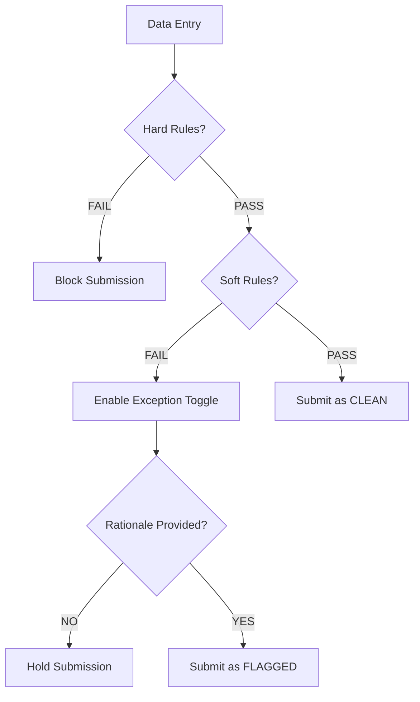
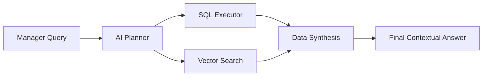

# AdmitGuard 🛡️
### An AI-Powered Distributed Governance Framework for High-Integrity Admissions

> **AdmitGuard** is a full-stack admission management system built around a **Chrome Browser Extension** (edge engine) + **Node.js/Express backend** + **admin web dashboard**. It enforces institutional admission rules in real-time, stores submissions in a vectorized PostgreSQL database, and gives managers an AI-augmented command center with live WebSocket updates.

---

## 📄 Abstract

AdmitGuard introduces a novel, distributed approach to admissions governance, leveraging a combination of **edge-validation algorithms**, **multi-stage AI reasoning**, and **latent semantic search**. By distributing rule enforcement to the point of data entry (Chrome Extension) and centralizing decision-making through an AI-augmented dashboard, the framework mitigates data entry errors, prevents identity spoofing, and provides management with deep, context-aware insights into admissions trends.

---

## 🚀 Technology Stack


---

## 🗂️ Repository Structure

```
AdmitGuard/
├── manifest.json          # Chrome Extension MV3 manifest
├── popup.html             # Extension main UI (admission form)
├── popup.js               # Extension logic: validation, auth, socket, submission
├── audit.html             # Extension audit log viewer page
├── audit.js               # Audit log logic
├── rules.json             # Local fallback rules + API URL config
├── socket.io.min.js       # Bundled Socket.io client for the extension
├── icons/                 # Extension icons
├── prompts/               # AI development prompts (sprint-by-sprint)
├── sprint-log.md          # Development sprint log
├── admin/
│   ├── index.html         # Admin login page (Google OAuth)
│   ├── admin.html         # Admin dashboard UI
│   ├── admin.js           # Dashboard logic: pipeline, AI assistant, real-time sync
│   ├── admin.css          # Dashboard styles
│   └── auth.js            # Google OAuth token handler
└── admitguard-backend/
    ├── server.js          # Express API + Socket.io + AI + PDF engine
    ├── package.json       # Node dependencies
    └── Dockerfile         # Docker container config (deployed on Render)
```

---

## ⚙️ System Architecture

AdmitGuard is a **three-tier distributed system**:

```
┌─────────────────────┐       WebSocket (Socket.io)        ┌─────────────────────┐
│   Chrome Extension  │ ◄──────────────────────────────── │  Admin Dashboard    │
│   (Edge Engine)     │                                     │  (Command Center)   │
│   popup.html/.js    │ ──── POST /api/submissions ───────► │  admin.html/.js     │
│   Counselor Login   │ ◄─── GET  /api/rules         ────  │  Google OAuth       │
└─────────────────────┘                                     └─────────────────────┘
           │                                                           │
           │              REST API + WebSockets                        │
           ▼                                                           ▼
┌─────────────────────────────────────────────────────────────────────────────────┐
│                     Node.js / Express Backend (Render)                          │
│  ┌──────────────┐  ┌────────────┐  ┌─────────────┐  ┌──────────────────────┐  │
│  │ Auth (OIDC + │  │ Rules CRUD │  │ Submissions  │  │ AI RAG Engine        │  │
│  │ JWT)         │  │ + Redis    │  │ + pgvector   │  │ (Groq Llama 3.3-70B) │  │
│  └──────────────┘  └────────────┘  └─────────────┘  └──────────────────────┘  │
│  ┌────────────────────────────────────────────────────────────────────────────┐ │
│  │  Automation: Resend Email (PDF attached) + Twilio WhatsApp + Sentry        │ │
│  └────────────────────────────────────────────────────────────────────────────┘ │
└─────────────────────────────────────────────────────────────────────────────────┘
           │                                           │
           ▼                                           ▼
┌─────────────────────┐                   ┌─────────────────────┐
│  Supabase Postgres  │                   │  Upstash Redis      │
│  (submissions,      │                   │  (rules cache,      │
│   rules, counselors │                   │   rate limiting)    │
│   + pgvector)       │                   └─────────────────────┘
└─────────────────────┘
```

---

## 🧩 Component Breakdown

### 1. 🔌 Chrome Extension (Edge Engine)

The browser extension is the **point-of-entry governance layer**. It runs entirely inside the officer's browser.

**Key Features:**
- **Counselor Login**: Staff authenticate via username/password against the backend JWT system. No Google login required at the edge.
- **11-Field Admission Form**: Name, Email, Phone, Aadhaar, Age, Qualification, Graduation Year, Percentage/CGPA, Screening Score, Interview Status, Offer Letter
- **Hard Rule Enforcement**: Name format, email regex + uniqueness, phone pattern, Aadhaar Verhoeff checksum, Interview Rejection block
- **Soft Rule Exceptions**: Age, Grad Year, Percentage/CGPA, Screening Score violations trigger an optional exception toggle with a keyword-validated rationale input
- **Real-time Rule Sync**: Socket.io client connects to the backend. When an admin updates rules, the extension updates instantly without a page reload
- **Auto-save Drafts**: Form state persisted to `chrome.storage.local` every 3 seconds
- **Audit Log**: A dedicated `audit.html` page shows all local submissions with search, filter, and CSV export
- **Remote Submission**: Submissions are pushed to the backend with a `Bearer` JWT token

**Submission Flow:**
```
Data Entry
    ↓
Hard Rules (Name, Email, Phone, Aadhaar, Interview)
    ↓ PASS
Soft Rules (Age, GPA, Grad Year, Score)
    ↓ VIOLATION? → Enable Exception Toggle
        ↓ YES (Exception Active + Valid Rationale)
        Submit as FLAGGED
    ↓ PASS (No Exception)
    Submit as CLEAN
```

---

### 2. 🖥️ Admin Dashboard (Command Center)

A standalone web app (hosted on **Vercel**) secured behind **Google OAuth 2.0**.

**Key Features:**
- **Google OAuth 2.0**: Admin login via Google identity. Token verified server-side using OIDC. Zero-trust email whitelist enforced via `ADMIN_EMAILS` env variable.
- **Real-time WebSocket Feed**: Dashboard auto-updates on `new_submission` and `decision_updated` socket events without manual refresh
- **Submission Table**: Searchable, filterable table with inline `APPROVE` / `REJECT` actions. Optimistic UI updates (instant visual change, rollback on error).
- **PII Masking**: One-click toggle masks email and name fields for privacy compliance during initial audits
- **Pipeline View (Kanban)**: Visual state-machine showing candidates in `Pending`, `Flagged`, `Approved`, `Rejected` columns
- **Audit Log View**: Full chronological log of all submissions with search
- **Bulk Actions**: Select multiple candidates and bulk approve/reject
- **AI Assistant (RAG)**: Chat sidebar powered by Groq Llama 3.3-70B. Answers quantitative queries (generates SQL) and qualitative queries (runs pgvector similarity search)
- **Rule Management**: Admins can edit all thresholds, keywords, and flags. Changes are instantly broadcast to all connected extensions via Socket.io
- **Staff Management**: Create/remove counselor accounts, view per-counselor stats (submissions, approvals, flags), generate and copy credentials

---

### 3. 🔧 Backend API (`admitguard-backend/`)

Node.js + Express server with Socket.io, deployed on **Render** via Docker.

**Endpoints:**

| Method | Path | Auth | Description |
|--------|------|------|-------------|
| `POST` | `/api/auth/login` | Public | Counselor JWT login |
| `GET` | `/api/rules` | Public | Get current rules (Redis cached) |
| `PUT` | `/api/rules` | Google OAuth | Update rules + broadcast via Socket |
| `POST` | `/api/submissions` | Counselor JWT | Create submission + trigger automations |
| `GET` | `/api/submissions` | Google OAuth / JWT | List all submissions |
| `PATCH` | `/api/submissions/:id/decision` | Google OAuth | Approve/Reject + notify |
| `DELETE` | `/api/submissions` | Google OAuth | Clear all submissions |
| `POST` | `/api/analyze` | Google OAuth | AI RAG query (Groq + pgvector) |
| `GET` | `/api/admin/counselors` | Google OAuth | List counselors |
| `POST` | `/api/admin/counselors` | Google OAuth | Create counselor account |
| `DELETE` | `/api/admin/counselors/:id` | Google OAuth | Remove counselor |
| `GET` | `/api/admin/stats/counselors` | Google OAuth | Per-counselor analytics |
| `GET` | `/health` | Public | Health check |

**Database Schema (Supabase PostgreSQL):**
```sql
-- Counselors (staff accounts)
counselors(id, name, username, password [bcrypt], created_at)

-- Submissions
submissions(
  id, candidate_id [unique], timestamp,
  flagged, exceptions_used[], fields [JSONB],
  rationale [JSONB], decision, counselor_id,
  rationale_vector [vector(384)]  ← pgvector
)

-- Rules
rules(id, config [JSONB], updated_at)
```

---

## 🤖 AI & Semantic Reasoning Engine

### RAG Pipeline (Retrieval-Augmented Generation)

When a manager asks a natural language question in the dashboard:

1. **Intent Classification** (Groq Llama 3): Determines if query is **quantitative** (generate SQL) or **qualitative** (semantic search)
2. **Query Execution**:
   - **SQL Path**: AI writes and executes a PostgreSQL query on the JSONB fields, returns exact data
   - **Vector Path**: Uses `Xenova/all-MiniLM-L6-v2` (384-dim) to embed the query, then runs cosine similarity search via pgvector `<=>` operator against stored rationale vectors
3. **Answer Synthesis**: Final Groq call combines raw results + semantic patterns into a professional analytical response

```
Manager Query → AI Planner (Groq)
                    ↓               ↓
               SQL Generator    Vector Search (pgvector)
                    ↓               ↓
                    └───── Merge ────┘
                               ↓
                    Synthesized AI Response
```

### Rationale Vectorization

Every exception rationale submitted by a counselor is embedded via `Xenova/all-MiniLM-L6-v2` and stored as a `vector(384)` in PostgreSQL. This enables semantic search across the entire exception history.

---

## 🔐 Security Model

| Layer | Mechanism | Scope |
|-------|-----------|-------|
| Extension Login | Username/Password → JWT (7-day) | Counselors only |
| Submission API | Bearer JWT validation | `POST /api/submissions` |
| Admin Dashboard | Google OAuth 2.0 (OIDC) | All admin endpoints |
| Email Whitelist | `ADMIN_EMAILS` + `OFFICER_EMAILS` env vars | Zero-trust allowlist |
| Aadhaar Validation | Verhoeff Algorithm (Dihedral group D₅) | Client-side hard rule |

**Public Endpoints**: `GET /api/rules`, `POST /api/auth/login`, `GET /health`  
**All other endpoints**: Require Google OAuth Bearer token or Counselor JWT

---

## 📬 Automation Pipeline

When specific events occur, the backend automatically:

| Event | WhatsApp (Twilio) | Email (Resend) |
|-------|-------------------|----------------|
| Submission received | ✅ Receipt message | ✅ Confirmation email |
| Decision = Approved | ✅ Congratulations | ✅ Email + **PDF Admission Letter** |
| Decision = Rejected | ✅ Rejection message | — |

The **PDF Admission Letter** is generated on-the-fly using PDFKit with:
- Branded header, watermark, official letter body
- Student details (name, email, qualification, intake year, screening score)
- Digital signature block
- Attached to the approval email via Resend

---

## ⚡ Real-Time WebSocket Events

Socket.io powers live sync between all connected clients:

| Event | Emitted When | Effect |
|-------|-------------|--------|
| `new_submission` | Counselor submits form | Dashboard table updates instantly |
| `decision_updated` | Manager approves/rejects | Extension gets live decision status |
| `rules_updated` | Admin saves rule changes | All extensions reload rules live |

---

## 🗺️ Deployment Architecture

| Component | Platform | Notes |
|-----------|----------|-------|
| Backend API + WebSockets | **Render** (Docker) | Node 18, auto-scaled |
| Admin Dashboard | **Vercel** | Global CDN |
| Database + pgvector | **Supabase** | PostgreSQL with connection pooling |
| Rules Cache | **Upstash Redis** | <10ms latency, LRU eviction, 24hr TTL |
| Error Monitoring | **Sentry** | Full stack traces + profiling |

---

## 🏗️ Data Integrity Algorithms

### Verhoeff Algorithm (Aadhaar Checksum)
Detects single-digit errors and adjacent transpositions using the non-commutative Dihedral group D₅. Implemented in pure JavaScript in the extension without any network round-trip.

```
validate(aadhaar) → Uses d[5][5] multiplication table + p[8][10] permutation table
→ Result must equal 0 for valid number
```

### Dynamic Rule Synchronization
1. Rules stored as `JSONB` in PostgreSQL (no schema migrations needed for rule changes)
2. Cached in Upstash Redis with 24-hour TTL
3. Cache invalidated on `PUT /api/rules`
4. Socket.io broadcasts new rules to all connected extension clients instantly

---

## 🖥️ Submission Validation Logic





---

## 🛠️ Local Development Setup

### Backend
```bash
cd admitguard-backend
npm install

# Create .env with:
# DATABASE_URL=<supabase postgres connection string>
# REDIS_URL=<upstash redis url>
# GROQ_API_KEY=<groq key>
# SENTRY_DSN=<sentry dsn>
# JWT_SECRET=<any secret string>
# ADMIN_EMAILS=your@email.com
# TWILIO_SID=<twilio sid>        (optional)
# TWILIO_TOKEN=<twilio token>    (optional)
# RESEND_API_KEY=<resend key>    (optional)

npm run dev   # nodemon server.js
```

### Chrome Extension
1. Open `chrome://extensions`
2. Enable **Developer Mode**
3. Click **Load Unpacked** → select the root `AdmitGuard/` folder
4. Update `rules.json` → `api_url` to point to your running backend
5. Click the AdmitGuard icon in the toolbar

### Admin Dashboard
Open `admin/index.html` directly in a browser, or deploy to Vercel. The backend URL is hardcoded in `admin.js` (`fallbackUrl`).

### Docker (Production)
```bash
cd admitguard-backend
docker build -t admitguard-backend .
docker run -p 3000:3000 --env-file .env admitguard-backend
```

---

## 🗝️ Environment Variables

| Variable | Required | Description |
|----------|----------|-------------|
| `DATABASE_URL` | ✅ | Supabase/PostgreSQL connection string |
| `REDIS_URL` | ✅ | Upstash Redis URL |
| `GROQ_API_KEY` | ✅ | Groq API key for Llama 3 |
| `JWT_SECRET` | ✅ | Secret for counselor JWT signing |
| `ADMIN_EMAILS` | ✅ | Comma-separated admin Google emails |
| `SENTRY_DSN` | ✅ | Sentry error tracking DSN |
| `OFFICER_EMAILS` | ⚠️ | Optional: extra whitelisted officer emails |
| `TWILIO_SID` | ⚠️ | Twilio account SID (WhatsApp optional) |
| `TWILIO_TOKEN` | ⚠️ | Twilio auth token |
| `RESEND_API_KEY` | ⚠️ | Resend email API key (optional) |
| `PORT` | auto | Set by Render automatically |

---

## 📊 Default Rules Configuration

The system seeds with these defaults (all configurable live from the dashboard):

| Rule | Default | Type |
|------|---------|------|
| Age | 18 – 35 | Soft |
| Graduation Year | 2015 – 2025 | Soft |
| Min Percentage | 60% | Soft |
| Min CGPA | 6.0 | Soft |
| Screening Score | 40 – 100 | Soft |
| Exception Limit | 2 (before FLAGGED) | Compliance |
| Rationale Min Length | 30 chars | Compliance |
| Exception Keywords | "approved by", "special case", "documentation pending", "waiver granted" | Compliance |
| Aadhaar Checksum | Enabled | Hard |
| Email Whitelist | Empty (all domains) | Hard |
| PII Masking | Enabled | Dashboard |
| Auto-save Draft | Enabled (3s interval) | UX |

---

## 📋 Sprint History

| Sprint | Features Delivered |
|--------|-------------------|
| 0 | Repo setup, manifest.json MV3, rules.json, research |
| 1 | 11-field popup form, dark theme, strict validators |
| 2 | Soft rules, exception toggle, keyword chips, rationale validation |
| 3 | Configurable rules engine, audit log with persistence & CSV export |
| 4 | UI polish, flag indicator, success overlay, full submission test |
| 5 | Backend (Node/Express), Supabase PostgreSQL, REST API |
| 6 | Admin dashboard (Google OAuth, pipeline view, PII masking) |
| 7 | AI RAG Engine (Groq Llama 3, pgvector, semantic search) |
| 8 | Redis caching, Sentry monitoring, Upstash integration |
| 9 | Twilio WhatsApp automation, Resend email + PDFKit admission letters |
| 10 | Socket.io real-time sync (extension ↔ dashboard ↔ backend) |
| 11 | Counselor/Staff system (JWT auth, creation, stats, credential sharing) |
| 12 | Dockerization, Render deployment, E2E testing |

---

## 🧪 Testing

Playwright E2E test suite covers:
- Clean submission flow (all rules pass)
- Hard rule violation (Aadhaar checksum fail, phone format)
- Soft rule exception (GPA waiver with valid rationale)
- Flagged submission (>2 exceptions)
- Admin dashboard deployment integrity (Vercel)

---

## 📚 Conclusions

AdmitGuard represents a shift in admissions technology from passive record-keeping to **active, automated governance**. By combining deterministic algorithms like Verhoeff with stochastic AI models like Llama 3 and real-time triggers via Twilio/Redis/Socket.io, the framework provides a **Human-in-the-Loop** system that is both rigid in its compliance and frictionless in its communication.

---

*Technical Documentation for AdmitGuard — Full-Stack Distributed Admissions Governance System*
